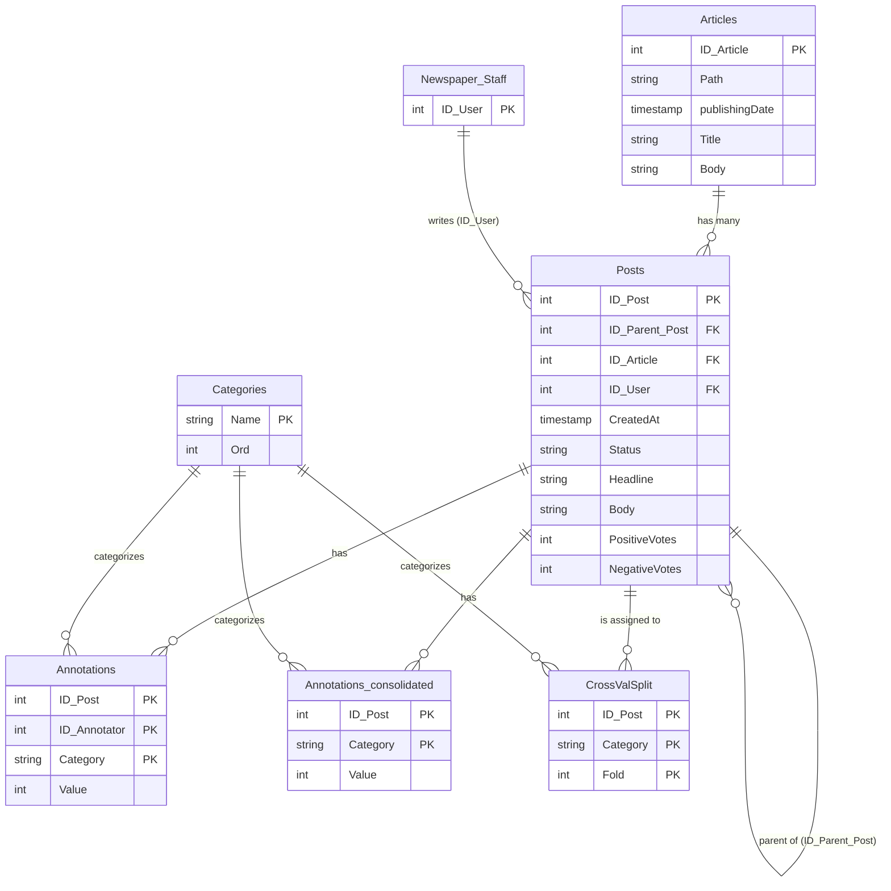

# Million Post Analytics

This project analyzes the **Million Post Corpus**, an annotated dataset of user comments from the Austrian newspaper *Der Standard*.

### Dataset Statistics
- **Source**: *Der Standard* (Austrian daily broadsheet)
- **Time Span**: April 23, 2003 to July 21, 2016 (13+ years of data)
- **Size**: 12,087 Articles and 1,011,773 Posts 

## Database Schema (Entity Relationship Diagram)

Below is the Entity Relationship Diagram describing the structure of the `corpus.sqlite3` database:



## Setup

To get started with the data:

1. Install the required dependencies:
   ```bash
   pip install -r requirements.txt
   ```
2. The dataset is stored as a SQLite database in `db/corpus.sqlite3`. To export it as CSV files for easier data analysis with Pandas, run:
   ```bash
   python db/export_data.py
   ```
   This will generate the CSV representations of the tables inside the `data/` directory.

## Data Source and Credits

The dataset used in this project is the **[Million Post Corpus](https://ofai.github.io/million-post-corpus/)**, an annotated corpus of user comments from the Austrian newspaper *Der Standard*.

This data is published under the [Creative Commons Attribution-NonCommercial-ShareAlike 4.0 International License (CC BY-NC-SA 4.0)](https://creativecommons.org/licenses/by-nc-sa/4.0/). All credit for the collection and annotation of this dataset goes to the original authors at the Austrian Research Institute for Artificial Intelligence (OFAI).
