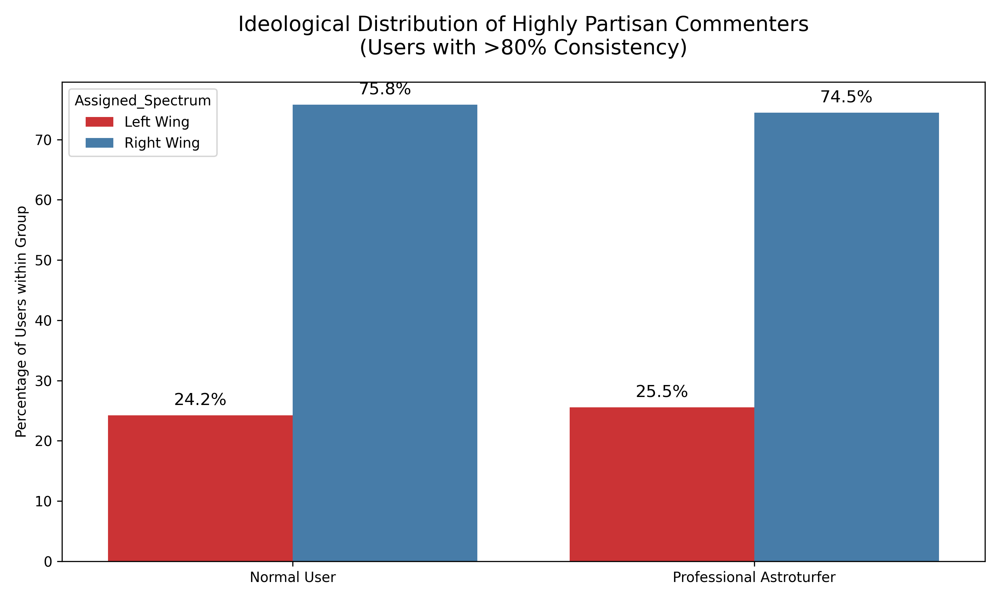
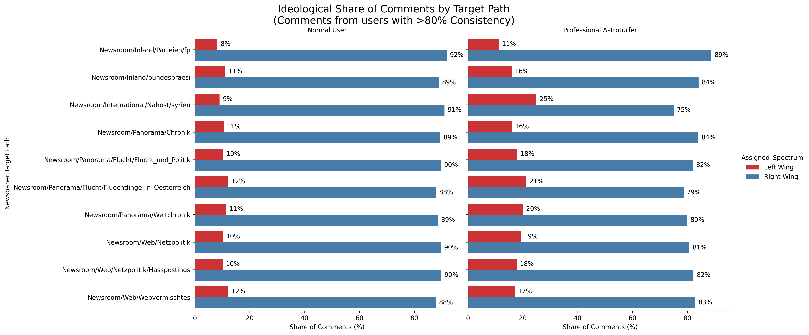

# Political Intent: Astroturfers vs Normal Users

These reports directly compare the ideological consistency and exact targets of Professional Writers against normal users.

## 1. Overall Ideological Share (Left vs Right)
This chart displays the percentage breakdown of ideological leanings across highly partisan users (>80% consistency).

## 2. Ideological Share by Specific Political Path
For the top 10 most targeted newspaper categories, this chart breaks down the ideological proportion of the comments. It directly contrasts the behavior of normal users on those topics versus the professional astroturfers.

