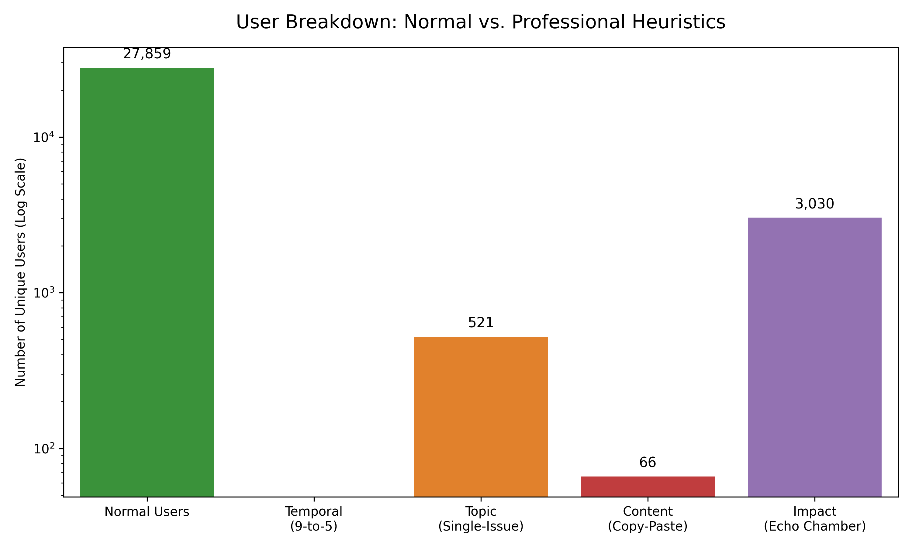

# Breakdown of Users: Normal vs. Professional Writers

This report details the exact number of users classified as "Normal" versus those classified as "Professional Writers" (Astroturfers), grouped by the specific analytical approach (heuristic) that caught them.

## Summary Counts
Out of **31,413** total unique users in the dataset:
* **Normal Users**: 27,859 (88.69%)
* **Professional Users**: 3,554 (11.31%)

*(Note: A professional user can be flagged by more than one heuristic simultaneously).*

## Breakdown by Analytical Approach
The 3,554 professional users were flagged by the following detection pillars:

* **Impact (Echo Chamber)**: 3,030 users
* **Topic (Single-Issue Hyperfocus)**: 521 users
* **Content (Copy-Paste Behavior)**: 66 users
* **Temporal (9-to-5 Working Hours)**: 0 users

### Visualization
Because the number of normal users vastly outweighs the professional users, the chart below uses a logarithmic scale to properly display all groups side-by-side.

