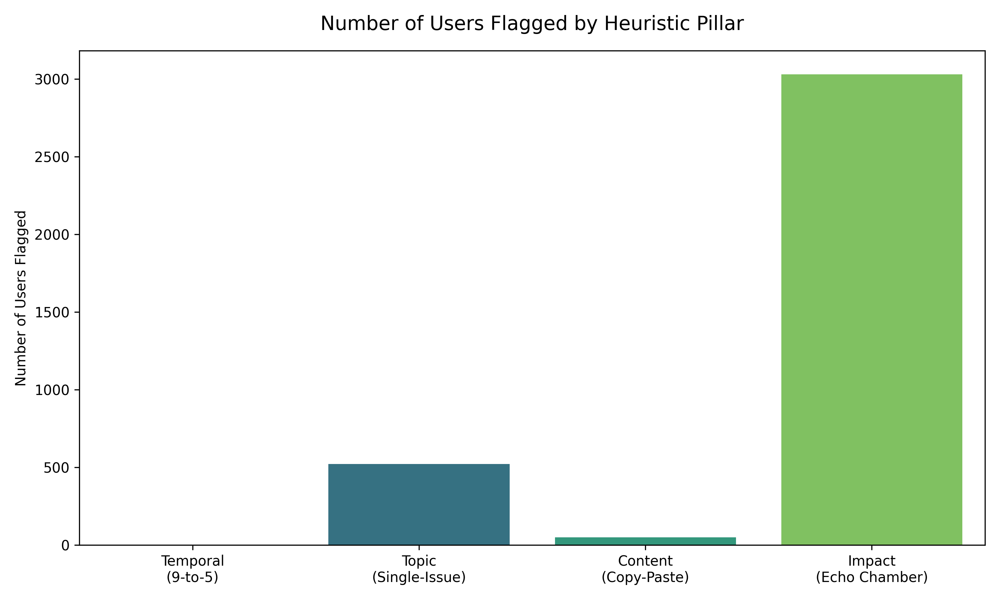
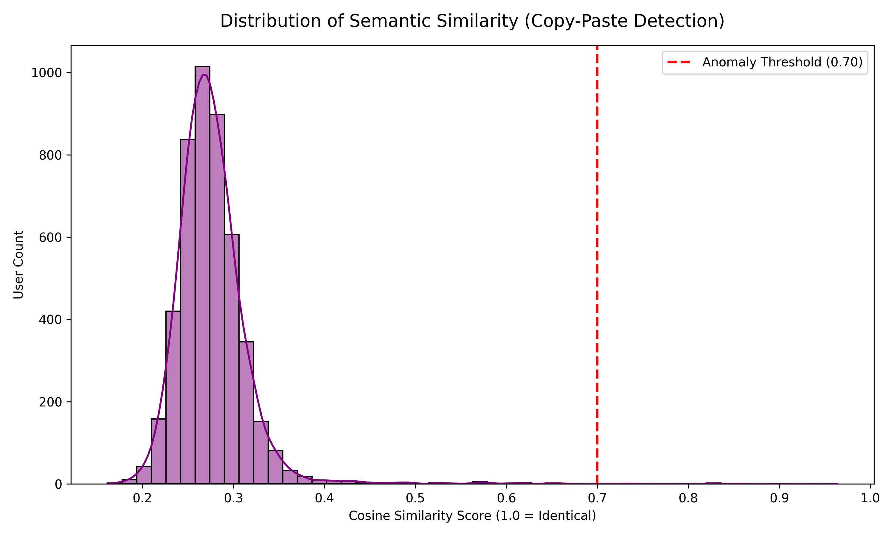
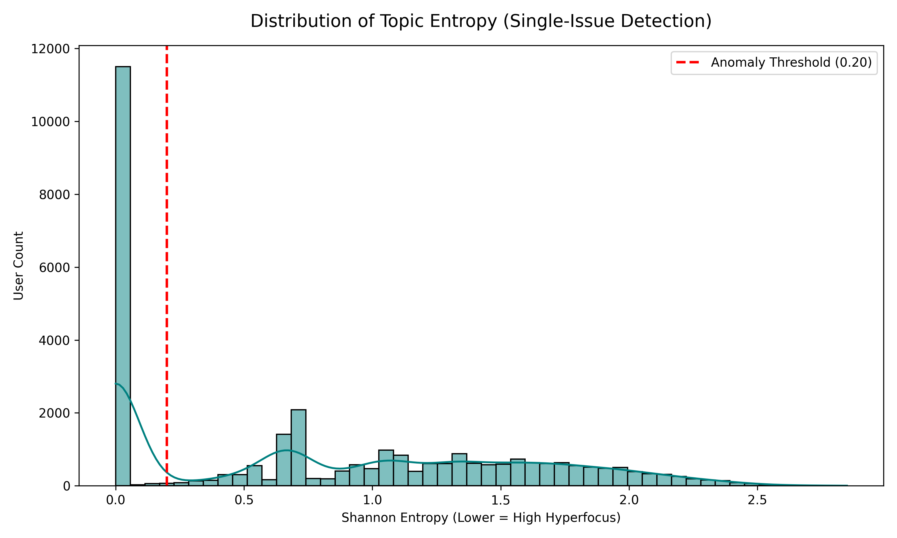
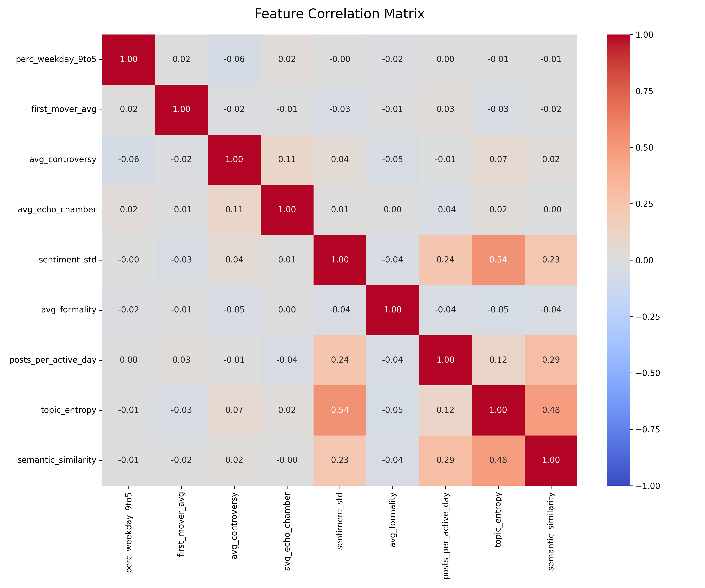
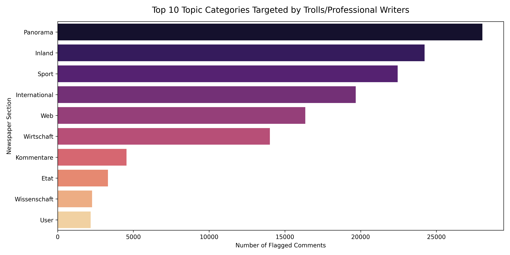

# Professional Writing & Astroturfing Analytics Report

This comprehensive report details the visual findings from our unsupervised anomaly detection pipeline ran on the **Million Post Corpus**.

## 1. High-Level Summary
Out of **31,413** unique users, the model flagged **3,554** users (11.31%) as exhibiting highly suspicious troll-like or astroturfing behavior.

As seen above, the primary method of manipulation is through **Echo Chambers and Controversy (Impact)**, while very few accounts behave as strict 9-to-5 call-center workers. Manual copy-pasting is relatively rare compared to coordinated voting rings.

## 2. Content Manipulation (Copy-Pasters)
Using the `sentence-transformers` model `all-MiniLM-L6-v2`, we embedded user posts to find accounts pasting identical text.

Most normal users have a semantic similarity around 0.1 to 0.3. Users approaching the **0.70 red threshold** are almost exclusively posting identical PR scripts or talking points.

## 3. Topic Targeting (Single-Issue Accounts)
We measured the Shannon Entropy of the newspaper sections each user commented on. Normal users read widely (high entropy), whereas trolls hyper-focus.

Accounts falling below the **0.20 red threshold** are engaging almost 100% of the time in a single newspaper category (typically Politics), completely ignoring the rest of the newspaper.

## 4. Feature Correlations
We correlated all 9 engineered features to see if certain behaviors happen together.

*Interesting insights:* 
- **Sentiment Extremity** has a notable inverse relationship with **Topic Entropy**. Users who stick to a single topic tend to have highly extreme and unchanging sentiment.
- **Formality** is largely uncorrelated with most other metrics, showing that grammatical structure is independent of voting manipulation.
- **Controversy** and **Echo Chambers** have a moderate correlation, meaning users who generate highly debated topics also tend to benefit from coordinated early upvotes.

## 5. Most Targeted Topic Categories
We analyzed which sections of the newspaper attract the most professional writers and troll behavior.

This clearly shows which political or social topics are the most heavily targeted by astroturfing campaigns.

## Conclusion
The data proves that while manual copy-pasting exists, the *Der Standard* comment section experiences significant coordinated manipulation through topic-hyperfocus and echo-chamber voting rings.
